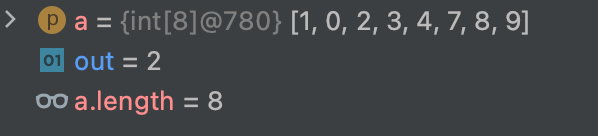
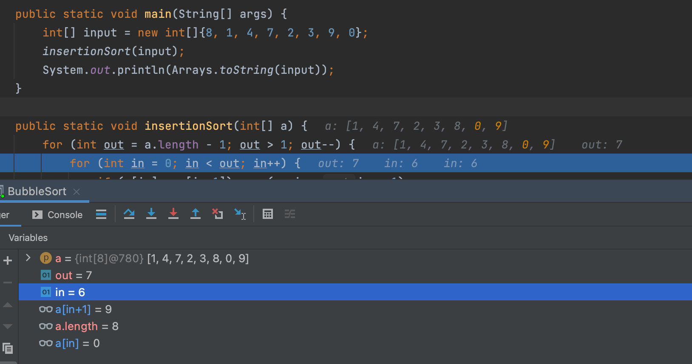

## Bubble sort

## Code
We will consider following code:

        for (int out = a.length - 1; out > 1; out--) {
            for (int in = 0; in < out; in++) {
                if (a[in] > a[in+1]) swap(a, in, in + 1);
            }
        }

## Sources
[java code](../src/playground/sort/bubble/BubbleSort.java)

## Edge cases
- `out = a.length - 1` - because we start from the last(a.length - 1) element;
- `out > 1` - we need to stop comparison when 2 elements left. No sense to continue when out <= 1;

For instance: 
- `in = 0` - because we start everytime from the 0 element(we decrease just end of the array to sort)
- `in < out` - not <= - because we don't need to compare out element with itself 
  
For instance: 
