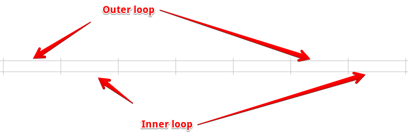

## Selection sort

## Code
We will consider following code:

        for (out = 0; out < a.length - 1; out++) {
            min = out;
            for (in = out + 1; in < a.length; in++) {
                if (a[in] < a[min]) min = in;
            }
            Utils.swap(a, out, min);
        }

## Sources
[java code](../src/playground/sort/selection/SelectionSort.java)

## Edge cases
- `out = 0` - because we start from 0 element
- `out < a.length - 1` - we reserve -1 element for the last cycle
- `in = out + 1` - because we don't want to compare with the same out element. The next is needed.
- `in < a.length` - we get the last item for comparison

Outer/inner ranges we can see like: 

